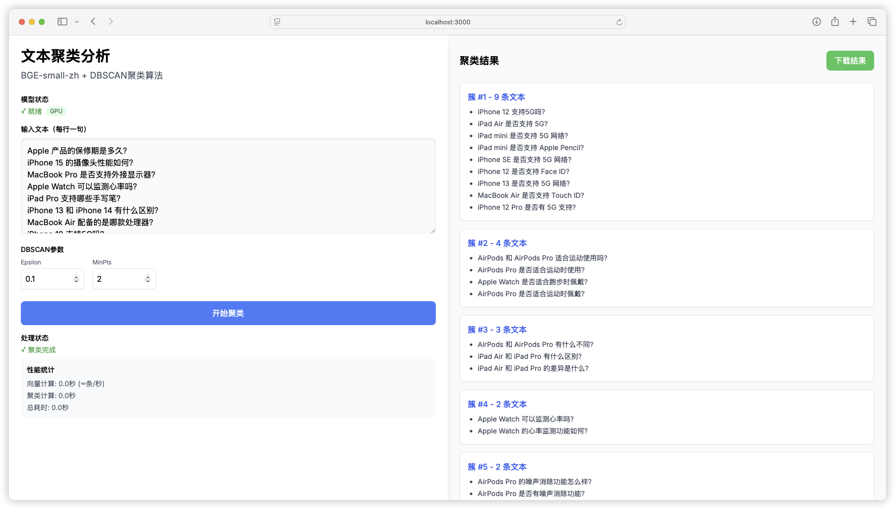

# Text2VectorCluster-Web-ZH

基于纯浏览器的中文短文本聚类工具，无需后端服务器，即开即用。

## 在线使用

[vercel在线使用](https://text2-vector-cluster-web-zh.vercel.app/)

首次访问时，加载模型数据可能需要约 10 秒，请耐心等待。

## 示例

以下是工具的使用示例：



## 项目特点

- 🚀 **纯浏览器实现**：完全基于浏览器运行，无需依赖后端服务器，方便部署与使用。
- ⚡ **高性能计算**：通过 transformers.js 提供高效的向量计算，支持 WebGPU 自动加速。
- 🔍 **高质量文本向量**：采用 BGE-small-zh 模型，生成精准的文本向量。
- 📊 **智能聚类算法**：利用 DBSCAN 聚类算法，自动识别文本簇，并支持 WebGPU 加速。
- 📈 **结果可视化**：提供直观的聚类结果展示，支持导出为 Excel 文件，便于后续分析。


## 使用方法

1. 访问在线演示页面
2. 在左侧输入框中输入要聚类的文本（每行一句）
3. 调整DBSCAN参数（可选）：
   - Epsilon：控制聚类的紧密程度
   - MinPts：最小簇大小
4. 点击"开始聚类"按钮
5. 在右侧查看聚类结果
6. 点击"下载结果"导出Excel文件

## 技术实现

- 前端框架：Next.js 13
- UI组件：Tailwind CSS
- 向量计算：transformers.js
- 文本向量模型：BGE-small-zh
- 聚类算法：DBSCAN

## 开发部署

```bash
# 安装依赖
npm install

# 启动开发服务器
npm run dev

# 构建生产版本
npm run build
```

## 致谢

- [Transformers.js](https://huggingface.co/docs/transformers.js/index) - 在浏览器中运行Transformer模型
- [BGE-small-zh-v1.5](https://huggingface.co/Xenova/bge-small-zh-v1.5) - 高质量的中文文本向量模型

## License

MIT License
